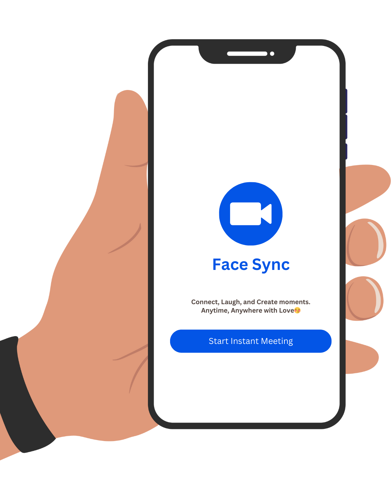
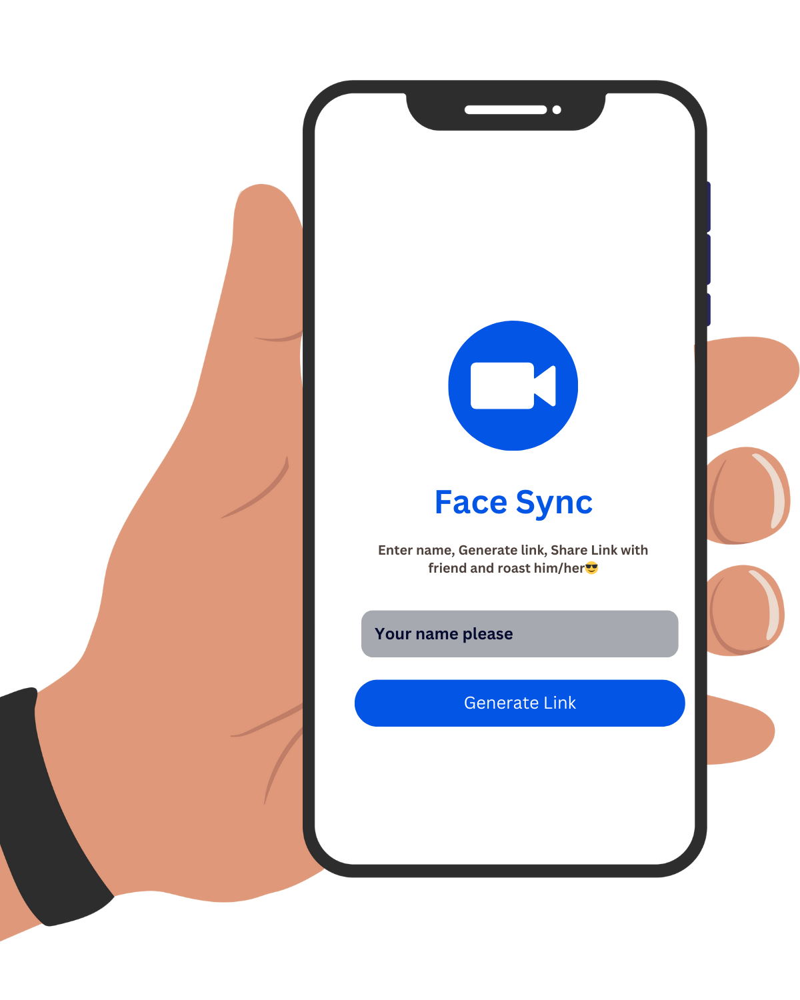
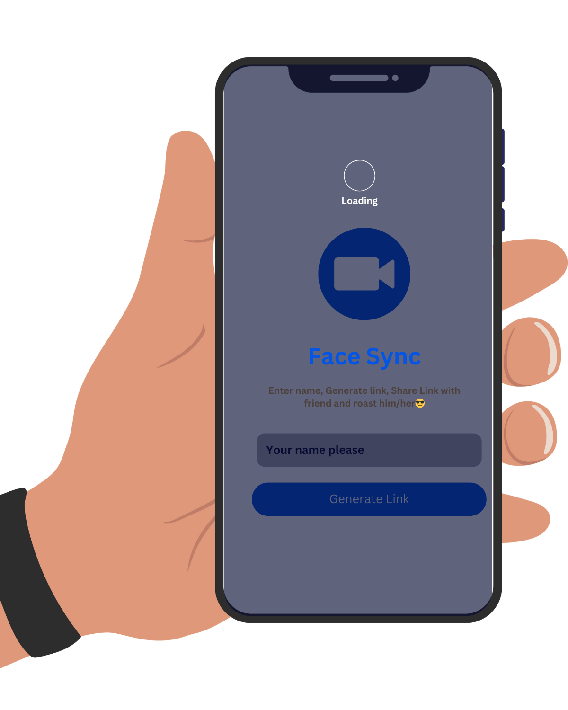
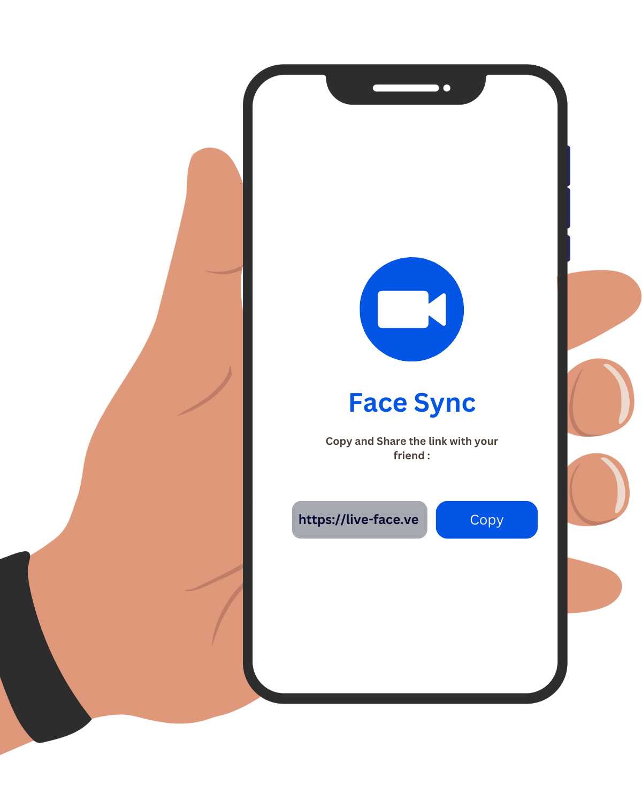
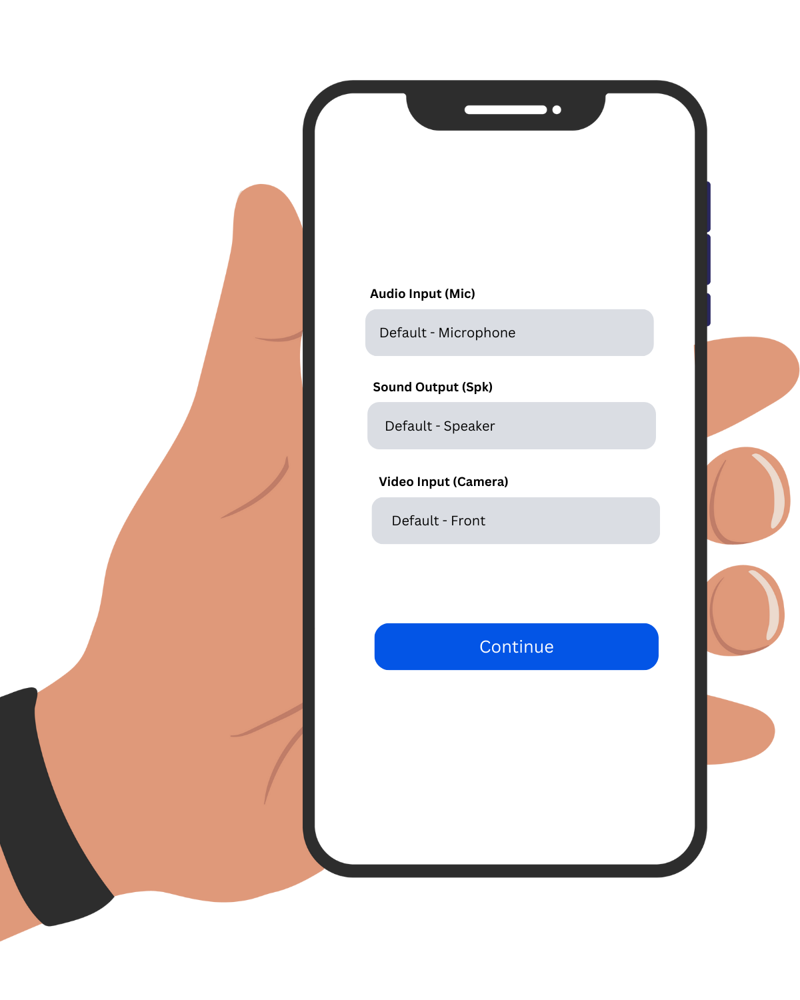
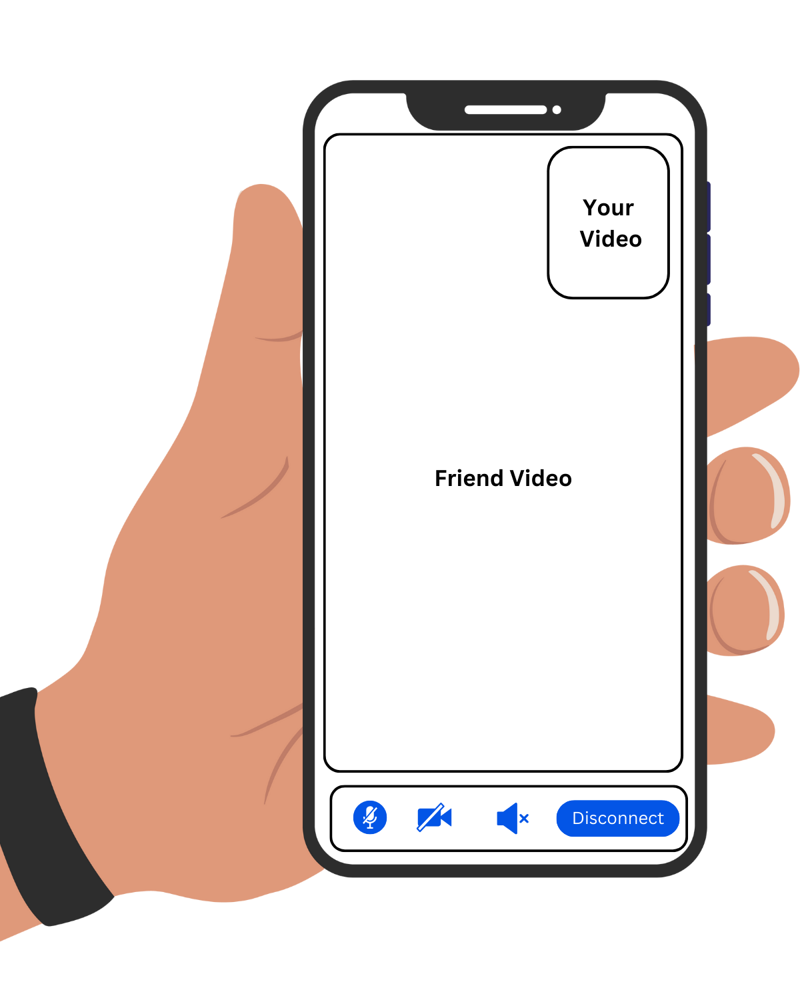
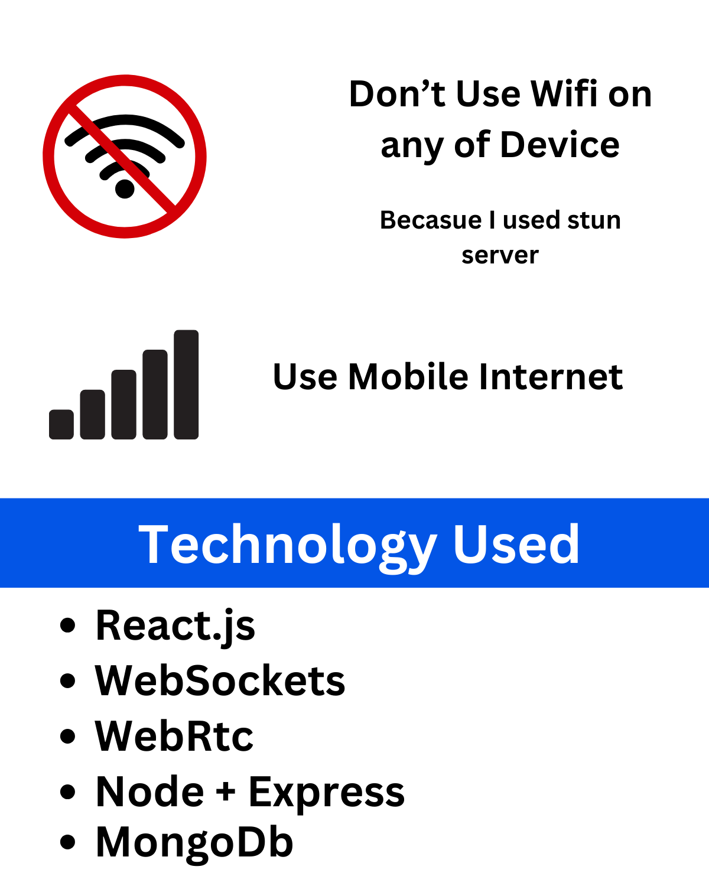

# FaceSync

**FaceSync** - A seamless video calling experience for everyone.

FaceSync is a modern video call application designed to provide users with a smooth and intuitive video conferencing experience. With features like generating meetings, sharing links, and controlling audio/video settings, FaceSync ensures you stay connected effortlessly.

---

## Features

- **Generate Meeting**: Create instant meeting rooms with a single click.
- **Share Link**: Easily share meeting links with participants.
- **Audio/Video Control**: Mute/unmute audio, turn video on/off, and switch between devices.
- **Device Management**: Change camera, microphone, or speaker during the call.
- **Real-Time Communication**: Powered by WebRTC and WebSockets for low-latency communication.
- **Secure Authentication**: JWT-based authentication for secure access.

---

## Technologies Used

- **Frontend**: ReactJS, Tailwind CSS, Recoil (State Management)
- **Backend**: Node.js, Express.js
- **Database**: MongoDB
- **Real-Time Communication**: WebRTC, WebSockets
- **Authentication**: JWT (JSON Web Tokens)
- **Deployment**: Vercel (Frontend), Render (Backend)

---

## Screenshots

Here are some screenshots of the application:

---

## Connect with Me

- **Portfolio**: [https://ravi-sinhmar.vercel.app](https://ravi-sinhmar.vercel.app)
- **LinkedIn**: [https://www.linkedin.com/in/ravi-sinhmar-b66124256/](https://www.linkedin.com/in/ravi-sinhmar-b66124256/)
- **GitHub**: [https://github.com/Ravi-Sinhmar](https://github.com/Ravi-Sinhmar)
- **Email**: [ravi.sinhmar28@gmail.com](mailto:ravi.sinhmar28@gmail.com)

---

